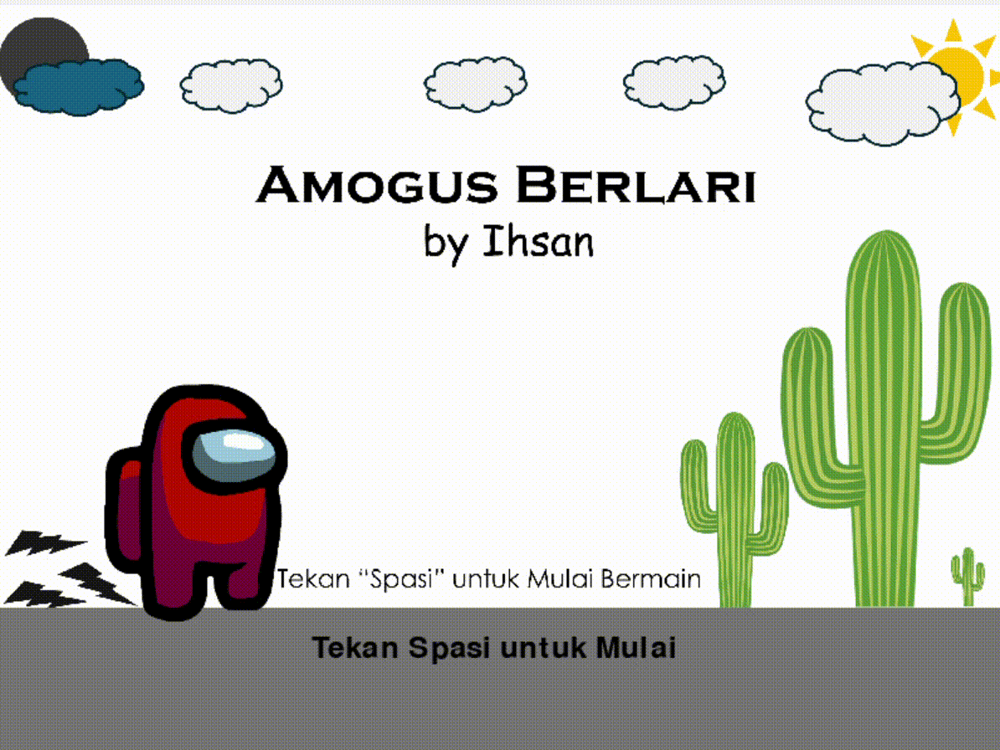

# 🌵 Amogus Berlari

> Game Endless Runner sederhana yang terinspirasi dari Chrome Dino, dibuat menggunakan Python dan Pygame.

*(Cuplikan gameplay Amogus Berlari)*

## 🎮 Tentang Game
**Amogus Berlari** adalah game arcade di mana pemain mengendalikan karakter Amogus untuk melompati rintangan kaktus di gurun tanpa batas. Semakin lama bartahan, permainan akan semakin cepat!

Game ini dibuat sebagai projek latihan **Object Oriented Programming (OOP)** dan logika fisika game dasar.

### ✨ Fitur Utama
* **Infinite Scrolling Background:** Latar belakang gurun tanpa batas dengan efek parallax.
* **Progressive Difficulty:** Kecepatan musuh bertambah seiring tingginya skor (Speed Up).
* **High Score System:** Menyimpan skor tertinggi selama sesi permainan.
* **Audio & SFX:** Musik latar dinamis dan efek suara lompatan/tabrakan.
* **Visual Effects:** Efek awan bergerak dan teks berkedip di menu.

## 🕹️ Cara Bermain (Controls)
Game ini sangat simpel dimainkan:
* **[SPASI]** : Melompat (Jump) / Mulai Game / Restart Game.
* **[ESC]** : Kembali ke Menu Utama.

Hindari kaktus dan bertahanlah selama mungkin untuk mencetak Rekor Tertinggi!

## 📥 Cara Download & Main (Tanpa Install Python)
Saya sudah menyediakan versi **Portable (.EXE)** agar bisa dimainkan di komputer mana saja tanpa perlu menginstall Python.

1. Download file 'Amogus_Berlari.zip'.
2. Ekstrak foldernya (Klik kanan -> Extract Here).
3. Buka folder hasil ekstrak, cari file 'AmogusBerlari.exe'.
4. Mainkan! 🚀

## 🛠️ Cara Menjalankan dari Source Code (Untuk Developer)
Jika kamu ingin melihat kodingannya atau memodifikasinya, pastikan kamu sudah menginstall Python.

1. Clone repository ini:
    '''bash
    git clone [https://github.com/IhsanDwiPutra/amogus-berlari.git](https://github.com/IhsanDwiPutra/amogus-berlari.git)
    '''
2. Install library Pygame:
    '''bash
    pip install pygame
    '''
3. Jalankan gamenya:
    '''bash
    python Amogus_Berlari.py
    '''

## 📂 Struktur Folder
* '/image' : Menyimpan aset gambar (Player, Musuh, Background).
* '/sound' : Menyimpan efek suara.
* '/music' : Menyimpan musik latar.
* 'Amogus_Berlari.py' : Kode utama game.

## 👨‍💻 Credits
Dibuat oleh **[Ihsan Dwi Putra]**.
Tanggal **[8 Januari 2026]**.
*Mahasiswa Informatika - Semester 1*

---
*Terima kasih sudah mencoba game ini! Jangan lupa kasih Bintang (⭐) di repo ini ya!*

🚧 **PROJECT UNDER CONSTRUCTION (SEDANG DIKERJAKAN)** 🚧

Game ini masih dalam tahap pengembangan aktif. Fitur mungkin belum lengkap atau masih ada bug.